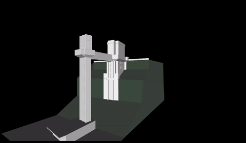

# Modelagem de um centro histórico: <b>Elevador Lacerda</b>
Feito com Blender 3.1, Pywavefront, Pyglet e PyOpenGL

<p align="center">
  
</p>

## Ações no teclado
Pressione <i>seta para esquerda</i> ou <i>A</i> para rotacionar o objeto no sentido anti-horário em torno do eixo Z.

## Como rodar
1. Instale as dependencias 
```
    pip install -r requirements.txt
```
2. Rode o comando
```
    python3 main.py
```
[@palomallacerda](https://github.com/palomallacerda)
[@yrribeiro](https://github.com/yrribeiro) | UFAL, 2022
