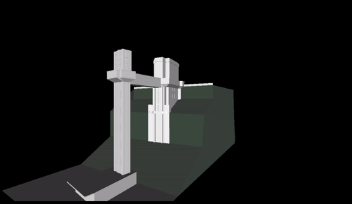
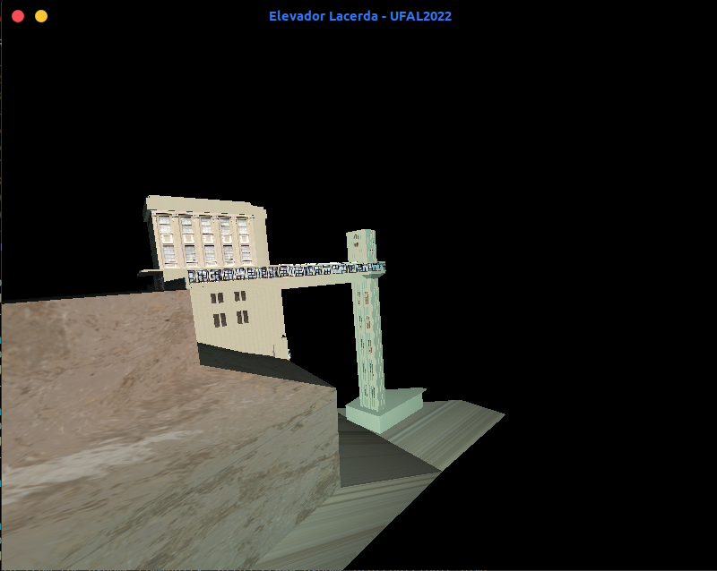
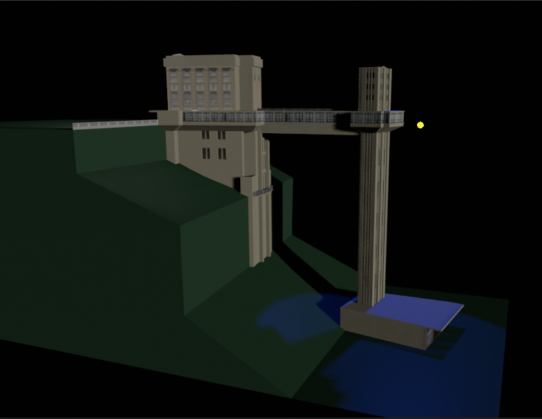
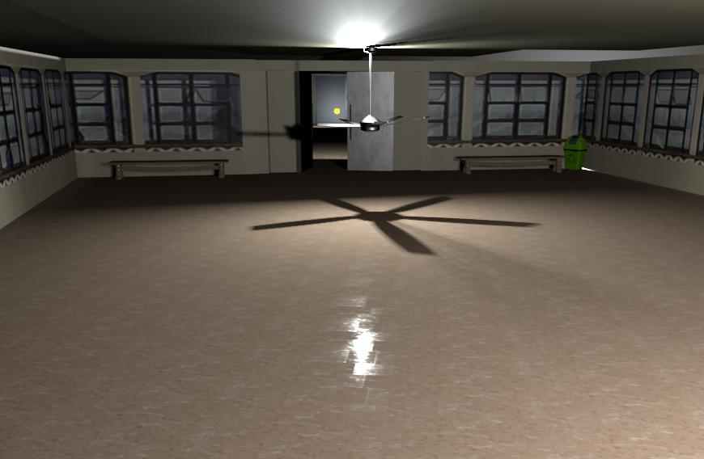

# Modelagem de um centro histórico: <b>Elevador Lacerda</b>
Feito com Blender 3.1, Pygame e PyOpenGL

<p align="center">
  
</p>

## Ações no teclado
Pressione o <i>botão esquerdo do mouse</i> para rotacionar o objeto.
Pressione o <i>botão direito do mouse</i> para mover o objeto.

## Como rodar
1. Instale as dependencias
```
    pip install -r requirements.txt
```
2. Rode o comando
```
    python3 main.py model.obj
```

## Com textura

### Pygame
<p align="center">
  
</p>

### Blender
<p align="center">
  
  
</p>


[@palomallacerda](https://github.com/palomallacerda)
[@yrribeiro](https://github.com/yrribeiro) | UFAL, 2022
